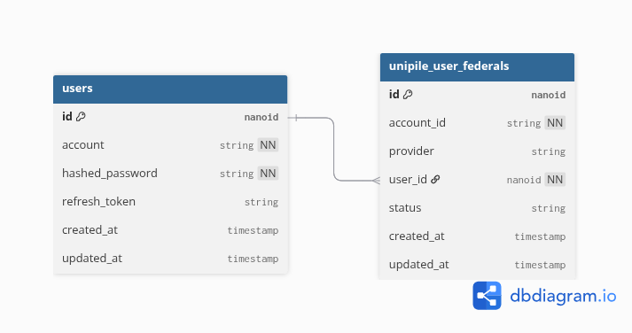
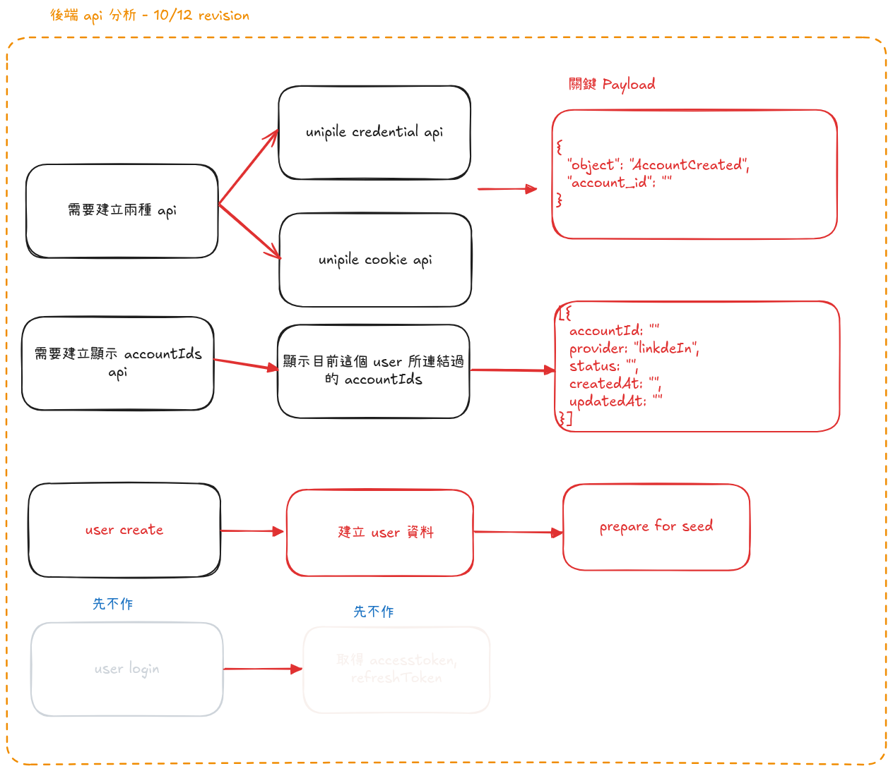
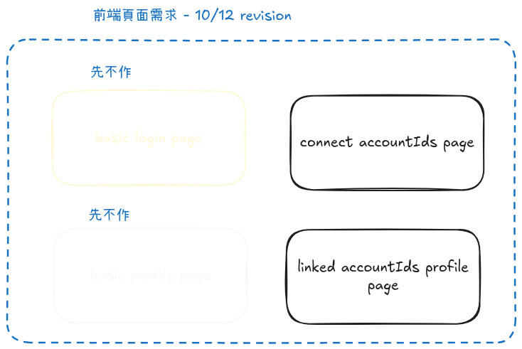

# unipile-authentication-with-linkedin

## Task:


Implement a small full-stack app that lets a user connect their LinkedIn account using Unipile's native authentication(not the hosted wizard). Once the account is connected, store the returned account_id for that user in a database. Please add both the cookie auth and the username/password login


## Requirements (high-level):

### Backend

* Expose an endpoint to trigger the Unipile LinkedIn connect flow.
* On success, capture and persist the account_id for the user.
* Provide a simple endpoint to fetch the user's stored accounts.

### Database

* Keep a table with users and their linked accounts (user_id, provider, account_id).
* Use any relational DB (SQLite, Postgres, MySQL).

### Frontend

* A basic form to submit either credentials or cookie information for LinkedIn.
* A page to display the saved account_id values for the current user.


## Deliverables:


* Source code for backend and frontend.(github repo link)
* Database schema/migrations.(github repo link)
* A hosted website url with the finished app (website url)

## dbml

```code=
Table users {
  id nanoid [primary key]
  account string [note: "origin user account", not null]
  passwd string [note: "hashed password", not null]
  refresh_token string [note: "for refresh token"]
  created_at timestamp
  updated_at timestamp
}

Table unipile_user_federal {
  id nanoid [primary key]
  account_id string [note: "linkedin account_id", not null]
  provider string [note: "for different provider, LinkedIn"]
  user_id nanoid [ref: > users.id, not null]
  status string [note: "record current linked status"]
  created_at timestamp
  updated_at timestamp
}
```

https://dbdiagram.io/d/linked-connected-account-6693da1a9939893daee177b8



## migration with goose

```shell
go install github.com/pressly/goose/v3/cmd/goose@latest
```

## 後端 api 分析



## 前端頁面分析



## TODO

- [ ] api 實做
- [ ] frontend 頁面劃分
- [ ] web framework 選擇, 目前暫時訂 gin
- [ ] deploy 平台